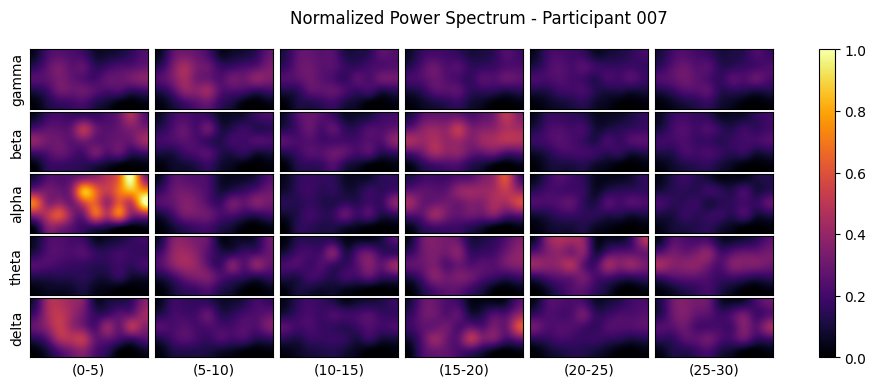

# ASD Detection

Collection of Neural Architectures for Detection of ASD, using EEG data.

## Data
```
TRAINING: X=(311, 150, 5, 6, 5), Y=(311,), Z=(311,)
TESTING: X=(180, 150, 5, 6, 5), Y=(180,), Z=(180,)
```

## Models Used
* **CONV** - Convolution Model
* **LSTM** - LSTM Model
* **CAPS** - CapsNet Model

## Results

| Model    | Loss     | MAE      | Accuracy |
|----------|----------|----------|----------|
| **CONV** | 0.7546   |**4.8930**|**0.8944**|
| **LSTM** | 0.9298   | 7.2092   | 0.8056   |
| **CAPS** | 0.3819   | 5.5865   | 0.8889   |

## Electrode Placement
```
F9  F7  F3  [Fz]  F4  F8  F10
FT7 FC5 FC1 [--]  FC2 FC6 FT8
T9  T7  C3  [--]  C4  T8  T10
TP7 CP5 CP1 [--]  CP2 CP6 TP8
P9  P7  P3  [Pz]  P4  P8  P10
```

## Power Spectrum Visualizations




## Model Architecture

### CONV Model
```
Model: "asd_conv"
______________________________________________________________________________________________________________________________________________________
Layer (type)                                     Output Shape                     Param #           Connected to                                      
======================================================================================================================================================
input_1 (InputLayer)                             [(None, 150, 5, 6, 5)]           0                                                                   
______________________________________________________________________________________________________________________________________________________
reshape (Reshape)                                (None, 150, 30, 5)               0                 input_1[0][0]                                     
______________________________________________________________________________________________________________________________________________________
conv_1 (Conv2D)                                  (None, 146, 30, 8)               208               reshape[0][0]                                     
______________________________________________________________________________________________________________________________________________________
db_bnrm_1_1 (BatchNormalization)                 (None, 146, 30, 8)               32                conv_1[0][0]                                      
______________________________________________________________________________________________________________________________________________________
db_relu_1_1 (ReLU)                               (None, 146, 30, 8)               0                 db_bnrm_1_1[0][0]                                 
______________________________________________________________________________________________________________________________________________________
db_conv_1_1 (Conv2D)                             (None, 146, 30, 8)               328               db_relu_1_1[0][0]                                 
______________________________________________________________________________________________________________________________________________________
db_drop_1_1 (Dropout)                            (None, 146, 30, 8)               0                 db_conv_1_1[0][0]                                 
______________________________________________________________________________________________________________________________________________________
db_bnrm_1_2 (BatchNormalization)                 (None, 146, 30, 8)               32                db_drop_1_1[0][0]                                 
______________________________________________________________________________________________________________________________________________________
db_relu_1_2 (ReLU)                               (None, 146, 30, 8)               0                 db_bnrm_1_2[0][0]                                 
______________________________________________________________________________________________________________________________________________________
db_conv_1_2 (Conv2D)                             (None, 146, 30, 8)               328               db_relu_1_2[0][0]                                 
______________________________________________________________________________________________________________________________________________________
db_drop_1_2 (Dropout)                            (None, 146, 30, 8)               0                 db_conv_1_2[0][0]                                 
______________________________________________________________________________________________________________________________________________________
c_1_2 (Concatenate)                              (None, 146, 30, 16)              0                 db_drop_1_1[0][0]                                 
                                                                                                    db_drop_1_2[0][0]                                 
______________________________________________________________________________________________________________________________________________________
db_bnrm_1_3 (BatchNormalization)                 (None, 146, 30, 16)              64                c_1_2[0][0]                                       
______________________________________________________________________________________________________________________________________________________
db_relu_1_3 (ReLU)                               (None, 146, 30, 16)              0                 db_bnrm_1_3[0][0]                                 
______________________________________________________________________________________________________________________________________________________
db_conv_1_3 (Conv2D)                             (None, 146, 30, 8)               648               db_relu_1_3[0][0]                                 
______________________________________________________________________________________________________________________________________________________
db_drop_1_3 (Dropout)                            (None, 146, 30, 8)               0                 db_conv_1_3[0][0]                                 
______________________________________________________________________________________________________________________________________________________
c_1_3 (Concatenate)                              (None, 146, 30, 24)              0                 db_drop_1_1[0][0]                                 
                                                                                                    db_drop_1_2[0][0]                                 
                                                                                                    db_drop_1_3[0][0]                                 
______________________________________________________________________________________________________________________________________________________
db_bnrm_1_4 (BatchNormalization)                 (None, 146, 30, 24)              96                c_1_3[0][0]                                       
______________________________________________________________________________________________________________________________________________________
db_relu_1_4 (ReLU)                               (None, 146, 30, 24)              0                 db_bnrm_1_4[0][0]                                 
______________________________________________________________________________________________________________________________________________________
db_conv_1_4 (Conv2D)                             (None, 146, 30, 8)               968               db_relu_1_4[0][0]                                 
______________________________________________________________________________________________________________________________________________________
db_drop_1_4 (Dropout)                            (None, 146, 30, 8)               0                 db_conv_1_4[0][0]                                 
______________________________________________________________________________________________________________________________________________________
c_1_4 (Concatenate)                              (None, 146, 30, 32)              0                 db_drop_1_1[0][0]                                 
                                                                                                    db_drop_1_2[0][0]                                 
                                                                                                    db_drop_1_3[0][0]                                 
                                                                                                    db_drop_1_4[0][0]                                 
______________________________________________________________________________________________________________________________________________________
tb_bnrm_1 (BatchNormalization)                   (None, 146, 30, 32)              128               c_1_4[0][0]                                       
______________________________________________________________________________________________________________________________________________________
tb_relu_1 (ReLU)                                 (None, 146, 30, 32)              0                 tb_bnrm_1[0][0]                                   
______________________________________________________________________________________________________________________________________________________
tb_conv_1 (Conv2D)                               (None, 146, 30, 32)              1056              tb_relu_1[0][0]                                   
______________________________________________________________________________________________________________________________________________________
tb_dropout_1 (Dropout)                           (None, 146, 30, 32)              0                 tb_conv_1[0][0]                                   
______________________________________________________________________________________________________________________________________________________
tb_pool_1 (AveragePooling2D)                     (None, 73, 30, 32)               0                 tb_dropout_1[0][0]                                
______________________________________________________________________________________________________________________________________________________
db_bnrm_2_1 (BatchNormalization)                 (None, 73, 30, 32)               128               tb_pool_1[0][0]                                   
______________________________________________________________________________________________________________________________________________________
db_relu_2_1 (ReLU)                               (None, 73, 30, 32)               0                 db_bnrm_2_1[0][0]                                 
______________________________________________________________________________________________________________________________________________________
db_conv_2_1 (Conv2D)                             (None, 73, 30, 8)                1288              db_relu_2_1[0][0]                                 
______________________________________________________________________________________________________________________________________________________
db_drop_2_1 (Dropout)                            (None, 73, 30, 8)                0                 db_conv_2_1[0][0]                                 
______________________________________________________________________________________________________________________________________________________
db_bnrm_2_2 (BatchNormalization)                 (None, 73, 30, 8)                32                db_drop_2_1[0][0]                                 
______________________________________________________________________________________________________________________________________________________
db_relu_2_2 (ReLU)                               (None, 73, 30, 8)                0                 db_bnrm_2_2[0][0]                                 
______________________________________________________________________________________________________________________________________________________
db_conv_2_2 (Conv2D)                             (None, 73, 30, 8)                328               db_relu_2_2[0][0]                                 
______________________________________________________________________________________________________________________________________________________
db_drop_2_2 (Dropout)                            (None, 73, 30, 8)                0                 db_conv_2_2[0][0]                                 
______________________________________________________________________________________________________________________________________________________
c_2_2 (Concatenate)                              (None, 73, 30, 16)               0                 db_drop_2_1[0][0]                                 
                                                                                                    db_drop_2_2[0][0]                                 
______________________________________________________________________________________________________________________________________________________
db_bnrm_2_3 (BatchNormalization)                 (None, 73, 30, 16)               64                c_2_2[0][0]                                       
______________________________________________________________________________________________________________________________________________________
db_relu_2_3 (ReLU)                               (None, 73, 30, 16)               0                 db_bnrm_2_3[0][0]                                 
______________________________________________________________________________________________________________________________________________________
db_conv_2_3 (Conv2D)                             (None, 73, 30, 8)                648               db_relu_2_3[0][0]                                 
______________________________________________________________________________________________________________________________________________________
db_drop_2_3 (Dropout)                            (None, 73, 30, 8)                0                 db_conv_2_3[0][0]                                 
______________________________________________________________________________________________________________________________________________________
c_2_3 (Concatenate)                              (None, 73, 30, 24)               0                 db_drop_2_1[0][0]                                 
                                                                                                    db_drop_2_2[0][0]                                 
                                                                                                    db_drop_2_3[0][0]                                 
______________________________________________________________________________________________________________________________________________________
db_bnrm_2_4 (BatchNormalization)                 (None, 73, 30, 24)               96                c_2_3[0][0]                                       
______________________________________________________________________________________________________________________________________________________
db_relu_2_4 (ReLU)                               (None, 73, 30, 24)               0                 db_bnrm_2_4[0][0]                                 
______________________________________________________________________________________________________________________________________________________
db_conv_2_4 (Conv2D)                             (None, 73, 30, 8)                968               db_relu_2_4[0][0]                                 
______________________________________________________________________________________________________________________________________________________
db_drop_2_4 (Dropout)                            (None, 73, 30, 8)                0                 db_conv_2_4[0][0]                                 
______________________________________________________________________________________________________________________________________________________
c_2_4 (Concatenate)                              (None, 73, 30, 32)               0                 db_drop_2_1[0][0]                                 
                                                                                                    db_drop_2_2[0][0]                                 
                                                                                                    db_drop_2_3[0][0]                                 
                                                                                                    db_drop_2_4[0][0]                                 
______________________________________________________________________________________________________________________________________________________
db_bnrm_2_5 (BatchNormalization)                 (None, 73, 30, 32)               128               c_2_4[0][0]                                       
______________________________________________________________________________________________________________________________________________________
db_relu_2_5 (ReLU)                               (None, 73, 30, 32)               0                 db_bnrm_2_5[0][0]                                 
______________________________________________________________________________________________________________________________________________________
db_conv_2_5 (Conv2D)                             (None, 73, 30, 8)                1288              db_relu_2_5[0][0]                                 
______________________________________________________________________________________________________________________________________________________
db_drop_2_5 (Dropout)                            (None, 73, 30, 8)                0                 db_conv_2_5[0][0]                                 
______________________________________________________________________________________________________________________________________________________
c_2_5 (Concatenate)                              (None, 73, 30, 40)               0                 db_drop_2_1[0][0]                                 
                                                                                                    db_drop_2_2[0][0]                                 
                                                                                                    db_drop_2_3[0][0]                                 
                                                                                                    db_drop_2_4[0][0]                                 
                                                                                                    db_drop_2_5[0][0]                                 
______________________________________________________________________________________________________________________________________________________
db_bnrm_2_6 (BatchNormalization)                 (None, 73, 30, 40)               160               c_2_5[0][0]                                       
______________________________________________________________________________________________________________________________________________________
db_relu_2_6 (ReLU)                               (None, 73, 30, 40)               0                 db_bnrm_2_6[0][0]                                 
______________________________________________________________________________________________________________________________________________________
db_conv_2_6 (Conv2D)                             (None, 73, 30, 8)                1608              db_relu_2_6[0][0]                                 
______________________________________________________________________________________________________________________________________________________
db_drop_2_6 (Dropout)                            (None, 73, 30, 8)                0                 db_conv_2_6[0][0]                                 
______________________________________________________________________________________________________________________________________________________
c_2_6 (Concatenate)                              (None, 73, 30, 48)               0                 db_drop_2_1[0][0]                                 
                                                                                                    db_drop_2_2[0][0]                                 
                                                                                                    db_drop_2_3[0][0]                                 
                                                                                                    db_drop_2_4[0][0]                                 
                                                                                                    db_drop_2_5[0][0]                                 
                                                                                                    db_drop_2_6[0][0]                                 
______________________________________________________________________________________________________________________________________________________
db_bnrm_2_7 (BatchNormalization)                 (None, 73, 30, 48)               192               c_2_6[0][0]                                       
______________________________________________________________________________________________________________________________________________________
db_relu_2_7 (ReLU)                               (None, 73, 30, 48)               0                 db_bnrm_2_7[0][0]                                 
______________________________________________________________________________________________________________________________________________________
db_conv_2_7 (Conv2D)                             (None, 73, 30, 8)                1928              db_relu_2_7[0][0]                                 
______________________________________________________________________________________________________________________________________________________
db_drop_2_7 (Dropout)                            (None, 73, 30, 8)                0                 db_conv_2_7[0][0]                                 
______________________________________________________________________________________________________________________________________________________
c_2_7 (Concatenate)                              (None, 73, 30, 56)               0                 db_drop_2_1[0][0]                                 
                                                                                                    db_drop_2_2[0][0]                                 
                                                                                                    db_drop_2_3[0][0]                                 
                                                                                                    db_drop_2_4[0][0]                                 
                                                                                                    db_drop_2_5[0][0]                                 
                                                                                                    db_drop_2_6[0][0]                                 
                                                                                                    db_drop_2_7[0][0]                                 
______________________________________________________________________________________________________________________________________________________
db_bnrm_2_8 (BatchNormalization)                 (None, 73, 30, 56)               224               c_2_7[0][0]                                       
______________________________________________________________________________________________________________________________________________________
db_relu_2_8 (ReLU)                               (None, 73, 30, 56)               0                 db_bnrm_2_8[0][0]                                 
______________________________________________________________________________________________________________________________________________________
db_conv_2_8 (Conv2D)                             (None, 73, 30, 8)                2248              db_relu_2_8[0][0]                                 
______________________________________________________________________________________________________________________________________________________
db_drop_2_8 (Dropout)                            (None, 73, 30, 8)                0                 db_conv_2_8[0][0]                                 
______________________________________________________________________________________________________________________________________________________
c_2_8 (Concatenate)                              (None, 73, 30, 64)               0                 db_drop_2_1[0][0]                                 
                                                                                                    db_drop_2_2[0][0]                                 
                                                                                                    db_drop_2_3[0][0]                                 
                                                                                                    db_drop_2_4[0][0]                                 
                                                                                                    db_drop_2_5[0][0]                                 
                                                                                                    db_drop_2_6[0][0]                                 
                                                                                                    db_drop_2_7[0][0]                                 
                                                                                                    db_drop_2_8[0][0]                                 
______________________________________________________________________________________________________________________________________________________
tb_bnrm_2 (BatchNormalization)                   (None, 73, 30, 64)               256               c_2_8[0][0]                                       
______________________________________________________________________________________________________________________________________________________
tb_relu_2 (ReLU)                                 (None, 73, 30, 64)               0                 tb_bnrm_2[0][0]                                   
______________________________________________________________________________________________________________________________________________________
tb_conv_2 (Conv2D)                               (None, 73, 30, 64)               4160              tb_relu_2[0][0]                                   
______________________________________________________________________________________________________________________________________________________
tb_dropout_2 (Dropout)                           (None, 73, 30, 64)               0                 tb_conv_2[0][0]                                   
______________________________________________________________________________________________________________________________________________________
tb_pool_2 (AveragePooling2D)                     (None, 36, 30, 64)               0                 tb_dropout_2[0][0]                                
______________________________________________________________________________________________________________________________________________________
flatten_ol (Flatten)                             (None, 69120)                    0                 tb_pool_2[0][0]                                   
______________________________________________________________________________________________________________________________________________________
l (Dense)                                        (None, 2)                        138242            flatten_ol[0][0]                                  
______________________________________________________________________________________________________________________________________________________
s (Dense)                                        (None, 1)                        69121             flatten_ol[0][0]                                  
======================================================================================================================================================
Total params: 226,995
Trainable params: 226,179
Non-trainable params: 816
______________________________________________________________________________________________________________________________________________________
```

### LSTM Model
```
Layer (type)                                     Output Shape                     Param #           Connected to                                      
======================================================================================================================================================
input_1 (InputLayer)                             [(None, 150, 5, 6, 5)]           0                                                                   
______________________________________________________________________________________________________________________________________________________
reshape (Reshape)                                (None, 150, 150)                 0                 input_1[0][0]                                     
______________________________________________________________________________________________________________________________________________________
h_lstm1 (LSTM)                                   (None, 150, 32)                  23424             reshape[0][0]                                     
______________________________________________________________________________________________________________________________________________________
h_lstm2 (LSTM)                                   (None, 150, 32)                  8320              h_lstm1[0][0]                                     
______________________________________________________________________________________________________________________________________________________
h_concat_1 (Concatenate)                         (None, 150, 64)                  0                 h_lstm1[0][0]                                     
                                                                                                    h_lstm2[0][0]                                     
______________________________________________________________________________________________________________________________________________________
h_lstm3 (LSTM)                                   (None, 150, 32)                  12416             h_concat_1[0][0]                                  
______________________________________________________________________________________________________________________________________________________
h_concat_2 (Concatenate)                         (None, 150, 96)                  0                 h_lstm1[0][0]                                     
                                                                                                    h_lstm2[0][0]                                     
                                                                                                    h_lstm3[0][0]                                     
______________________________________________________________________________________________________________________________________________________
h_lstm4 (LSTM)                                   (None, 150, 32)                  16512             h_concat_2[0][0]                                  
______________________________________________________________________________________________________________________________________________________
h_concat_3 (Concatenate)                         (None, 150, 128)                 0                 h_lstm1[0][0]                                     
                                                                                                    h_lstm2[0][0]                                     
                                                                                                    h_lstm3[0][0]                                     
                                                                                                    h_lstm4[0][0]                                     
______________________________________________________________________________________________________________________________________________________
f_lstm (LSTM)                                    (None, 32)                       20608             h_concat_3[0][0]                                  
______________________________________________________________________________________________________________________________________________________
dense (Dense)                                    (None, 32)                       1056              f_lstm[0][0]                                      
______________________________________________________________________________________________________________________________________________________
l (Dense)                                        (None, 2)                        66                dense[0][0]                                       
______________________________________________________________________________________________________________________________________________________
s (Dense)                                        (None, 1)                        33                dense[0][0]                                       
======================================================================================================================================================
Total params: 82,435
Trainable params: 82,435
Non-trainable params: 0
______________________________________________________________________________________________________________________________________________________
```

### CAPS Model
```
Model: "asd_caps"
______________________________________________________________________________________________________________________________________________________
Layer (type)                                     Output Shape                     Param #           Connected to                                      
======================================================================================================================================================
input_1 (InputLayer)                             [(None, 150, 5, 6, 5)]           0                                                                   
______________________________________________________________________________________________________________________________________________________
eeg (Reshape)                                    (None, 150, 30, 5)               0                 input_1[0][0]                                     
______________________________________________________________________________________________________________________________________________________
conv_1 (Conv2D)                                  (None, 146, 30, 8)               208               eeg[0][0]                                         
______________________________________________________________________________________________________________________________________________________
db_bnrm_1_1 (BatchNormalization)                 (None, 146, 30, 8)               32                conv_1[0][0]                                      
______________________________________________________________________________________________________________________________________________________
db_relu_1_1 (ReLU)                               (None, 146, 30, 8)               0                 db_bnrm_1_1[0][0]                                 
______________________________________________________________________________________________________________________________________________________
db_conv_1_1 (Conv2D)                             (None, 146, 30, 8)               328               db_relu_1_1[0][0]                                 
______________________________________________________________________________________________________________________________________________________
db_drop_1_1 (Dropout)                            (None, 146, 30, 8)               0                 db_conv_1_1[0][0]                                 
______________________________________________________________________________________________________________________________________________________
db_bnrm_1_2 (BatchNormalization)                 (None, 146, 30, 8)               32                db_drop_1_1[0][0]                                 
______________________________________________________________________________________________________________________________________________________
db_relu_1_2 (ReLU)                               (None, 146, 30, 8)               0                 db_bnrm_1_2[0][0]                                 
______________________________________________________________________________________________________________________________________________________
db_conv_1_2 (Conv2D)                             (None, 146, 30, 8)               328               db_relu_1_2[0][0]                                 
______________________________________________________________________________________________________________________________________________________
db_drop_1_2 (Dropout)                            (None, 146, 30, 8)               0                 db_conv_1_2[0][0]                                 
______________________________________________________________________________________________________________________________________________________
c_1_2 (Concatenate)                              (None, 146, 30, 16)              0                 db_drop_1_1[0][0]                                 
                                                                                                    db_drop_1_2[0][0]                                 
______________________________________________________________________________________________________________________________________________________
db_bnrm_1_3 (BatchNormalization)                 (None, 146, 30, 16)              64                c_1_2[0][0]                                       
______________________________________________________________________________________________________________________________________________________
db_relu_1_3 (ReLU)                               (None, 146, 30, 16)              0                 db_bnrm_1_3[0][0]                                 
______________________________________________________________________________________________________________________________________________________
db_conv_1_3 (Conv2D)                             (None, 146, 30, 8)               648               db_relu_1_3[0][0]                                 
______________________________________________________________________________________________________________________________________________________
db_drop_1_3 (Dropout)                            (None, 146, 30, 8)               0                 db_conv_1_3[0][0]                                 
______________________________________________________________________________________________________________________________________________________
c_1_3 (Concatenate)                              (None, 146, 30, 24)              0                 db_drop_1_1[0][0]                                 
                                                                                                    db_drop_1_2[0][0]                                 
                                                                                                    db_drop_1_3[0][0]                                 
______________________________________________________________________________________________________________________________________________________
db_bnrm_1_4 (BatchNormalization)                 (None, 146, 30, 24)              96                c_1_3[0][0]                                       
______________________________________________________________________________________________________________________________________________________
db_relu_1_4 (ReLU)                               (None, 146, 30, 24)              0                 db_bnrm_1_4[0][0]                                 
______________________________________________________________________________________________________________________________________________________
db_conv_1_4 (Conv2D)                             (None, 146, 30, 8)               968               db_relu_1_4[0][0]                                 
______________________________________________________________________________________________________________________________________________________
db_drop_1_4 (Dropout)                            (None, 146, 30, 8)               0                 db_conv_1_4[0][0]                                 
______________________________________________________________________________________________________________________________________________________
c_1_4 (Concatenate)                              (None, 146, 30, 32)              0                 db_drop_1_1[0][0]                                 
                                                                                                    db_drop_1_2[0][0]                                 
                                                                                                    db_drop_1_3[0][0]                                 
                                                                                                    db_drop_1_4[0][0]                                 
______________________________________________________________________________________________________________________________________________________
tb_bnrm_1 (BatchNormalization)                   (None, 146, 30, 32)              128               c_1_4[0][0]                                       
______________________________________________________________________________________________________________________________________________________
tb_relu_1 (ReLU)                                 (None, 146, 30, 32)              0                 tb_bnrm_1[0][0]                                   
______________________________________________________________________________________________________________________________________________________
tb_conv_1 (Conv2D)                               (None, 146, 30, 32)              1056              tb_relu_1[0][0]                                   
______________________________________________________________________________________________________________________________________________________
tb_dropout_1 (Dropout)                           (None, 146, 30, 32)              0                 tb_conv_1[0][0]                                   
______________________________________________________________________________________________________________________________________________________
tb_pool_1 (AveragePooling2D)                     (None, 73, 30, 32)               0                 tb_dropout_1[0][0]                                
______________________________________________________________________________________________________________________________________________________
db_bnrm_2_1 (BatchNormalization)                 (None, 73, 30, 32)               128               tb_pool_1[0][0]                                   
______________________________________________________________________________________________________________________________________________________
db_relu_2_1 (ReLU)                               (None, 73, 30, 32)               0                 db_bnrm_2_1[0][0]                                 
______________________________________________________________________________________________________________________________________________________
db_conv_2_1 (Conv2D)                             (None, 73, 30, 8)                1288              db_relu_2_1[0][0]                                 
______________________________________________________________________________________________________________________________________________________
db_drop_2_1 (Dropout)                            (None, 73, 30, 8)                0                 db_conv_2_1[0][0]                                 
______________________________________________________________________________________________________________________________________________________
db_bnrm_2_2 (BatchNormalization)                 (None, 73, 30, 8)                32                db_drop_2_1[0][0]                                 
______________________________________________________________________________________________________________________________________________________
db_relu_2_2 (ReLU)                               (None, 73, 30, 8)                0                 db_bnrm_2_2[0][0]                                 
______________________________________________________________________________________________________________________________________________________
db_conv_2_2 (Conv2D)                             (None, 73, 30, 8)                328               db_relu_2_2[0][0]                                 
______________________________________________________________________________________________________________________________________________________
db_drop_2_2 (Dropout)                            (None, 73, 30, 8)                0                 db_conv_2_2[0][0]                                 
______________________________________________________________________________________________________________________________________________________
c_2_2 (Concatenate)                              (None, 73, 30, 16)               0                 db_drop_2_1[0][0]                                 
                                                                                                    db_drop_2_2[0][0]                                 
______________________________________________________________________________________________________________________________________________________
db_bnrm_2_3 (BatchNormalization)                 (None, 73, 30, 16)               64                c_2_2[0][0]                                       
______________________________________________________________________________________________________________________________________________________
db_relu_2_3 (ReLU)                               (None, 73, 30, 16)               0                 db_bnrm_2_3[0][0]                                 
______________________________________________________________________________________________________________________________________________________
db_conv_2_3 (Conv2D)                             (None, 73, 30, 8)                648               db_relu_2_3[0][0]                                 
______________________________________________________________________________________________________________________________________________________
db_drop_2_3 (Dropout)                            (None, 73, 30, 8)                0                 db_conv_2_3[0][0]                                 
______________________________________________________________________________________________________________________________________________________
c_2_3 (Concatenate)                              (None, 73, 30, 24)               0                 db_drop_2_1[0][0]                                 
                                                                                                    db_drop_2_2[0][0]                                 
                                                                                                    db_drop_2_3[0][0]                                 
______________________________________________________________________________________________________________________________________________________
db_bnrm_2_4 (BatchNormalization)                 (None, 73, 30, 24)               96                c_2_3[0][0]                                       
______________________________________________________________________________________________________________________________________________________
db_relu_2_4 (ReLU)                               (None, 73, 30, 24)               0                 db_bnrm_2_4[0][0]                                 
______________________________________________________________________________________________________________________________________________________
db_conv_2_4 (Conv2D)                             (None, 73, 30, 8)                968               db_relu_2_4[0][0]                                 
______________________________________________________________________________________________________________________________________________________
db_drop_2_4 (Dropout)                            (None, 73, 30, 8)                0                 db_conv_2_4[0][0]                                 
______________________________________________________________________________________________________________________________________________________
c_2_4 (Concatenate)                              (None, 73, 30, 32)               0                 db_drop_2_1[0][0]                                 
                                                                                                    db_drop_2_2[0][0]                                 
                                                                                                    db_drop_2_3[0][0]                                 
                                                                                                    db_drop_2_4[0][0]                                 
______________________________________________________________________________________________________________________________________________________
db_bnrm_2_5 (BatchNormalization)                 (None, 73, 30, 32)               128               c_2_4[0][0]                                       
______________________________________________________________________________________________________________________________________________________
db_relu_2_5 (ReLU)                               (None, 73, 30, 32)               0                 db_bnrm_2_5[0][0]                                 
______________________________________________________________________________________________________________________________________________________
db_conv_2_5 (Conv2D)                             (None, 73, 30, 8)                1288              db_relu_2_5[0][0]                                 
______________________________________________________________________________________________________________________________________________________
db_drop_2_5 (Dropout)                            (None, 73, 30, 8)                0                 db_conv_2_5[0][0]                                 
______________________________________________________________________________________________________________________________________________________
c_2_5 (Concatenate)                              (None, 73, 30, 40)               0                 db_drop_2_1[0][0]                                 
                                                                                                    db_drop_2_2[0][0]                                 
                                                                                                    db_drop_2_3[0][0]                                 
                                                                                                    db_drop_2_4[0][0]                                 
                                                                                                    db_drop_2_5[0][0]                                 
______________________________________________________________________________________________________________________________________________________
db_bnrm_2_6 (BatchNormalization)                 (None, 73, 30, 40)               160               c_2_5[0][0]                                       
______________________________________________________________________________________________________________________________________________________
db_relu_2_6 (ReLU)                               (None, 73, 30, 40)               0                 db_bnrm_2_6[0][0]                                 
______________________________________________________________________________________________________________________________________________________
db_conv_2_6 (Conv2D)                             (None, 73, 30, 8)                1608              db_relu_2_6[0][0]                                 
______________________________________________________________________________________________________________________________________________________
db_drop_2_6 (Dropout)                            (None, 73, 30, 8)                0                 db_conv_2_6[0][0]                                 
______________________________________________________________________________________________________________________________________________________
c_2_6 (Concatenate)                              (None, 73, 30, 48)               0                 db_drop_2_1[0][0]                                 
                                                                                                    db_drop_2_2[0][0]                                 
                                                                                                    db_drop_2_3[0][0]                                 
                                                                                                    db_drop_2_4[0][0]                                 
                                                                                                    db_drop_2_5[0][0]                                 
                                                                                                    db_drop_2_6[0][0]                                 
______________________________________________________________________________________________________________________________________________________
db_bnrm_2_7 (BatchNormalization)                 (None, 73, 30, 48)               192               c_2_6[0][0]                                       
______________________________________________________________________________________________________________________________________________________
db_relu_2_7 (ReLU)                               (None, 73, 30, 48)               0                 db_bnrm_2_7[0][0]                                 
______________________________________________________________________________________________________________________________________________________
db_conv_2_7 (Conv2D)                             (None, 73, 30, 8)                1928              db_relu_2_7[0][0]                                 
______________________________________________________________________________________________________________________________________________________
db_drop_2_7 (Dropout)                            (None, 73, 30, 8)                0                 db_conv_2_7[0][0]                                 
______________________________________________________________________________________________________________________________________________________
c_2_7 (Concatenate)                              (None, 73, 30, 56)               0                 db_drop_2_1[0][0]                                 
                                                                                                    db_drop_2_2[0][0]                                 
                                                                                                    db_drop_2_3[0][0]                                 
                                                                                                    db_drop_2_4[0][0]                                 
                                                                                                    db_drop_2_5[0][0]                                 
                                                                                                    db_drop_2_6[0][0]                                 
                                                                                                    db_drop_2_7[0][0]                                 
______________________________________________________________________________________________________________________________________________________
db_bnrm_2_8 (BatchNormalization)                 (None, 73, 30, 56)               224               c_2_7[0][0]                                       
______________________________________________________________________________________________________________________________________________________
db_relu_2_8 (ReLU)                               (None, 73, 30, 56)               0                 db_bnrm_2_8[0][0]                                 
______________________________________________________________________________________________________________________________________________________
db_conv_2_8 (Conv2D)                             (None, 73, 30, 8)                2248              db_relu_2_8[0][0]                                 
______________________________________________________________________________________________________________________________________________________
db_drop_2_8 (Dropout)                            (None, 73, 30, 8)                0                 db_conv_2_8[0][0]                                 
______________________________________________________________________________________________________________________________________________________
c_2_8 (Concatenate)                              (None, 73, 30, 64)               0                 db_drop_2_1[0][0]                                 
                                                                                                    db_drop_2_2[0][0]                                 
                                                                                                    db_drop_2_3[0][0]                                 
                                                                                                    db_drop_2_4[0][0]                                 
                                                                                                    db_drop_2_5[0][0]                                 
                                                                                                    db_drop_2_6[0][0]                                 
                                                                                                    db_drop_2_7[0][0]                                 
                                                                                                    db_drop_2_8[0][0]                                 
______________________________________________________________________________________________________________________________________________________
tb_bnrm_2 (BatchNormalization)                   (None, 73, 30, 64)               256               c_2_8[0][0]                                       
______________________________________________________________________________________________________________________________________________________
tb_relu_2 (ReLU)                                 (None, 73, 30, 64)               0                 tb_bnrm_2[0][0]                                   
______________________________________________________________________________________________________________________________________________________
tb_conv_2 (Conv2D)                               (None, 73, 30, 64)               4160              tb_relu_2[0][0]                                   
______________________________________________________________________________________________________________________________________________________
tb_dropout_2 (Dropout)                           (None, 73, 30, 64)               0                 tb_conv_2[0][0]                                   
______________________________________________________________________________________________________________________________________________________
tb_pool_2 (AveragePooling2D)                     (None, 36, 30, 64)               0                 tb_dropout_2[0][0]                                
______________________________________________________________________________________________________________________________________________________
conv_caps (ConvCaps2D)                           (None, 16, 30, 8, 4)             10272             tb_pool_2[0][0]                                   
______________________________________________________________________________________________________________________________________________________
lambda (Lambda)                                  (None, 16, 30, 8, 4)             0                 conv_caps[0][0]                                   
______________________________________________________________________________________________________________________________________________________
dense_caps (DenseCaps)                           (None, 2, 8)                     245760            lambda[0][0]                                      
______________________________________________________________________________________________________________________________________________________
lambda_1 (Lambda)                                (None, 2, 8)                     0                 dense_caps[0][0]                                  
______________________________________________________________________________________________________________________________________________________
lambda_2 (Lambda)                                (None, 8)                        0                 lambda_1[0][0]                                    
______________________________________________________________________________________________________________________________________________________
l (Lambda)                                       (None, 2)                        0                 lambda_1[0][0]                                    
______________________________________________________________________________________________________________________________________________________
s (Dense)                                        (None, 1)                        9                 lambda_2[0][0]                                    
======================================================================================================================================================
Total params: 275,673
Trainable params: 274,857
Non-trainable params: 816
______________________________________________________________________________________________________________________________________________________
```

